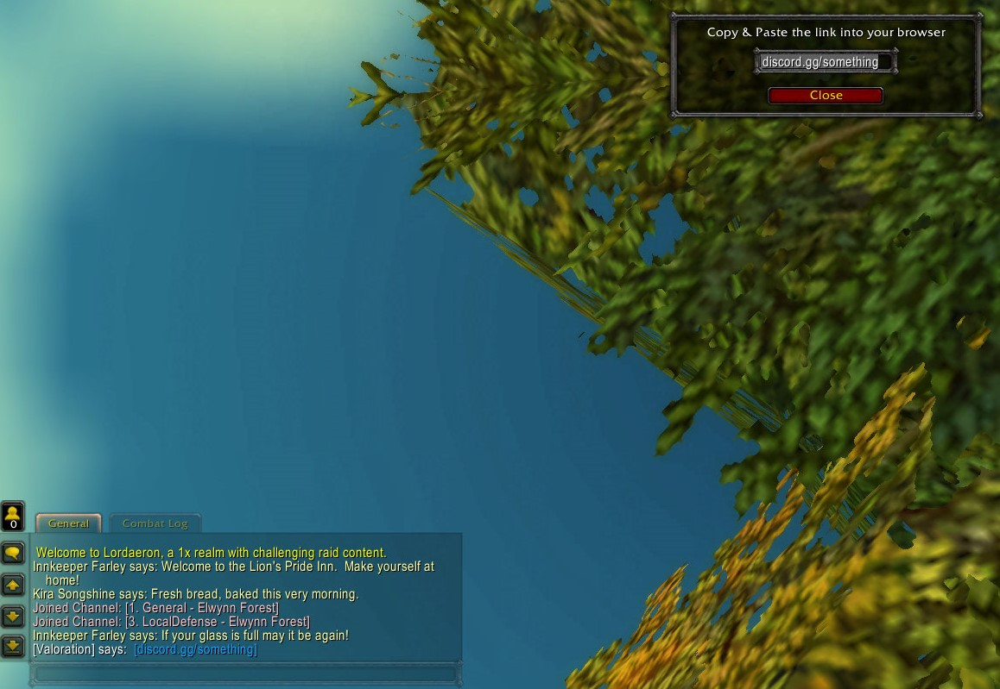

# Linked Text

This addon will make links appear in blue in any of your chats, it will also make them clickable so you easily can copy the link. 
For example if you type discord.gg/YourServer it will become clickable and make a popup when clicked. 
The popup's text will automatically be highlighted, so you easily can copy and paste it. 
This is useable with all kinds of links, such as google.com. 

# Install

To install the addon go to [releases](https://github.com/olivernybo/wow-linked-text/releases/) and download the [latest release](https://github.com/olivernybo/wow-linked-text/releases/latest).  
After you have downloaded the addon, unzip it and place it in your World of Warcraft addon directory.